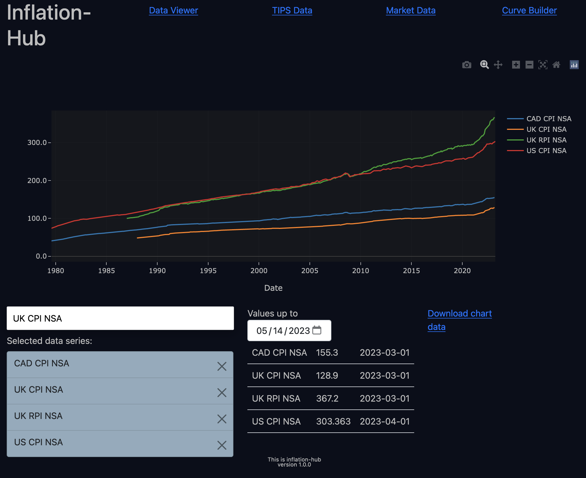
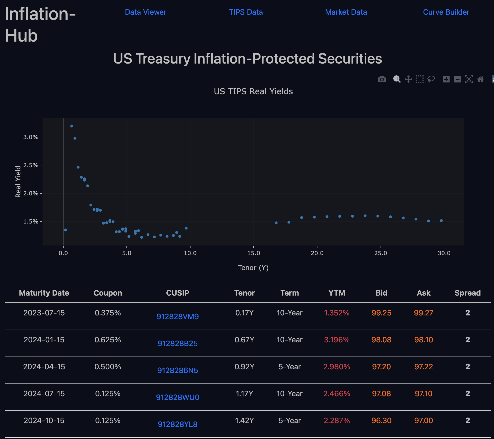
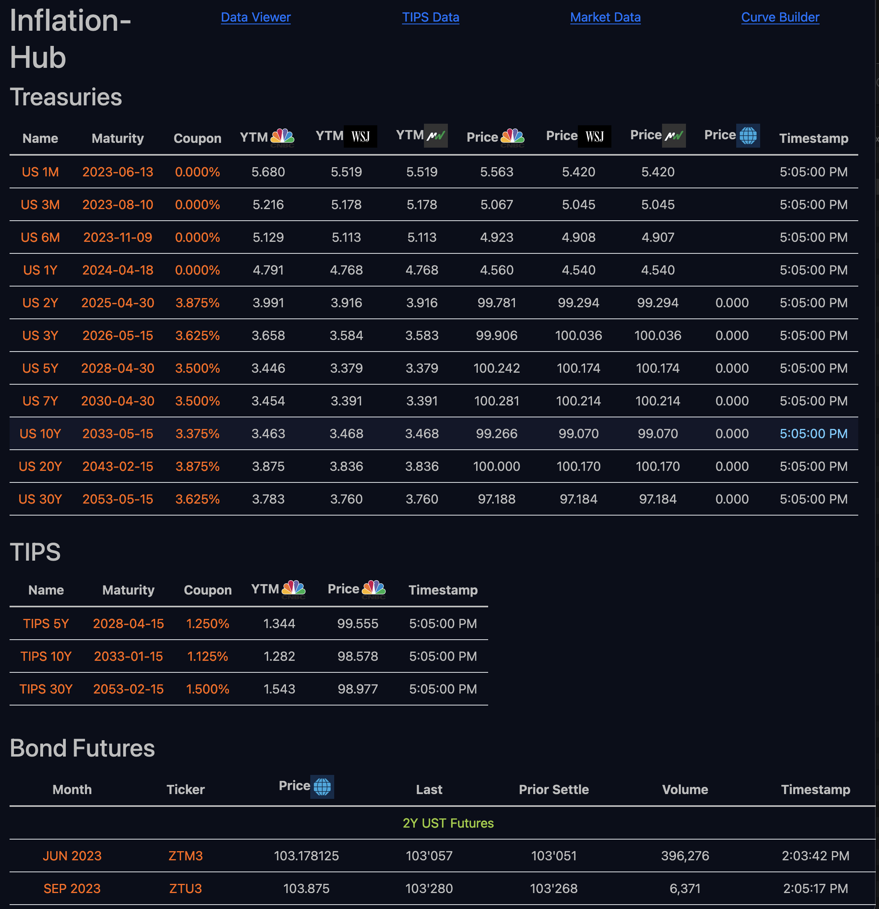
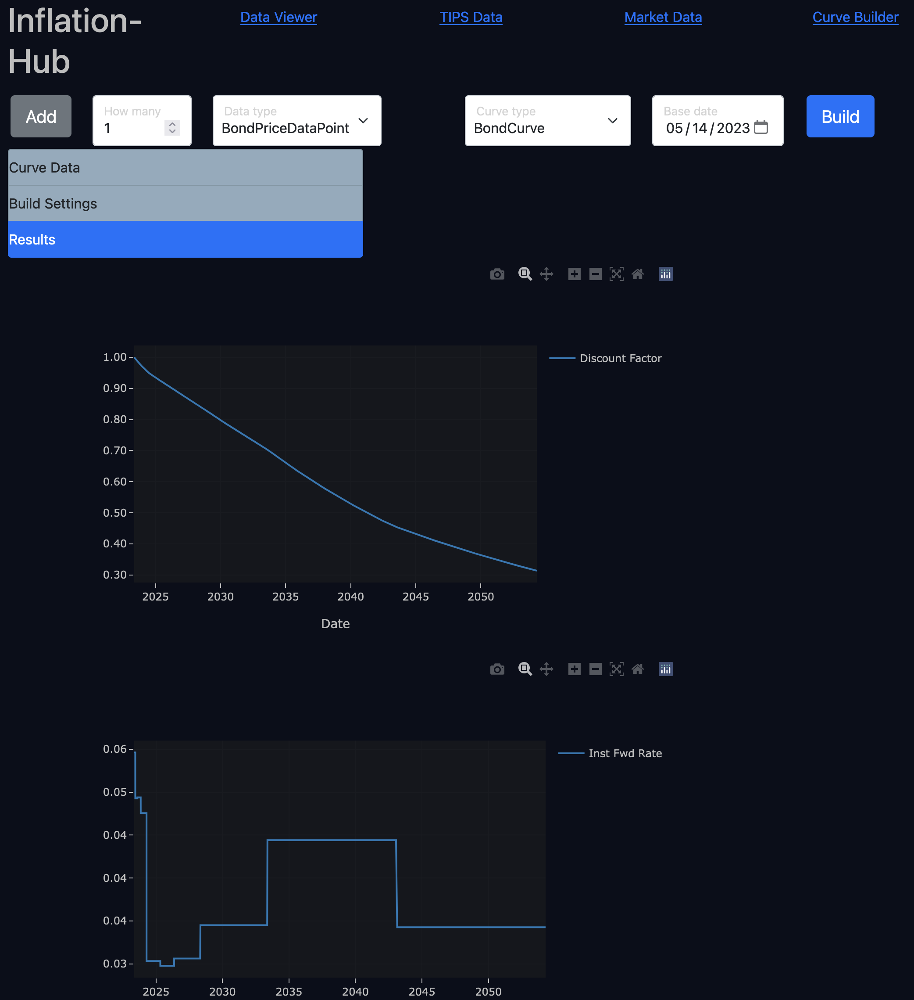

# InflationHub

InflationHub is a hobby project to build a research platform for inflation and rates data analysis, market data, curve construction and more, as time permits. It is a web app with a Python Flask back end and JavaScript React front end. Historical data and market data are scraped from external web pages and displayed in a unified framework. The app is not publicly hosted at the current time.

The app pages are:

- [Data Viewer](#data_viewer)
- [TIPS Data](#tips_data)
- [Market Data](#market_data)
- [Curve Builder](#curve_builder)

## Data Viewer

View and download historical time series for a variety of economic data related to inflation and interest rates. The main focus is US but some global data series are included.

## TIPS Data

End of day prices for all US Treasury Inflation-Protected Securities, including historical yield time series where available.

## Market Data

US Treasury monitor with ticking intraday prices for on-the-run bills, notes, bonds, TIPS and bond futures.

## Curve Builder

Calibrate a pricing curve for nominal bonds, CPI and seasonality. The bond curve uses current US OTR quotes from the Market Data page. CPI and seasonality use free-form input entered with the Add points button.

